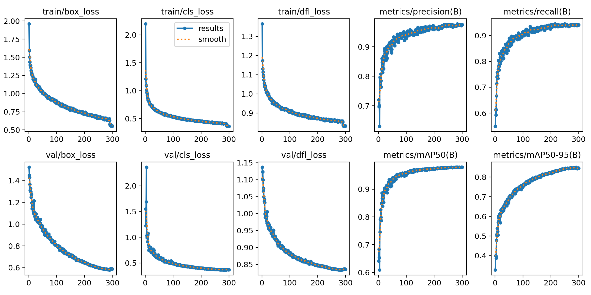

# Solar Panel Object Detection

This project aims to detect solar panels in satellite imagery using Ultralytics YOLO. Submitted by Nishchay Bhutoria, a second-year B.Tech in Artificial Intelligence student at IIT Gandhinagar.

---

## 📂 **Project Structure**
- **`dataset_understanding.ipynb`** – Data exploration and understanding
- **`fundamental_functions.ipynb`** – Implementation of key functions (IoU, AP, PR metrics)
- **`model.ipynb`** – Model training, evaluation, and visualization

---

## **📊 Data Exploration and Understanding**
*Implemented in* `dataset_understanding.ipynb`

### 1️⃣ **Dataset Statistics**
- **Total solar panel instances**: Counted from labels (29625).
- **Distribution of labels per image**: Histogram created to show most images contain between 1 and 10 solar panels.
- **Images without labels**: Identified and removed duplicate images without corresponding annotations.

📌 **Plot:**  


---

### 2️⃣ **Solar Panel Area Analysis**
- The **area of each solar panel** was computed from bounding box dimensions using the dataset’s 31 cm resolution. A detailed write-up is available in `dataset_understanding.ipynb`.
- **Mean area**: Computed along with standard deviation (Mean: 191.51 sq. m, Standard Deviation: 630.70 sq. m).
- **Histogram plotted** to visualize the distribution of solar panel sizes.

📌 **Histogram:**  


---

## **🔢 Implementing Fundamental Functions**
*Implemented in* `fundamental_functions.ipynb`

### 1️⃣ **Intersection over Union (IoU)**
- IoU was computed using **Shapely** and validated against **Supervision's IoU function**.
- Both methods produced equivalent values, confirming correctness.

📌 **Example Output:**  
```
YOLO Box 1: (292, 270, 183, 188), YOLO Box 2: (299, 163, 198, 186)
IoU (Shapely): 0.2587, IoU (Supervision): 0.2587
Difference: 0.000000
```

---

### 2️⃣ **Average Precision (AP) Computation**
- Implemented three **AP computation methods**:
  - **Pascal VOC 11-point**
  - **COCO 101-point**
  - **Area under PR curve (AUC)**

📌 **Example Output:**  
```
AP50 (VOC 11-point interpolation): 0.3643053602753117
AP50 (COCO 101-point interpolation): 0.34080351926680075
AP50 (Area Under PR Curve): 0.3042650500236363
```
The AP50 metric provides a way to evaluate object detection models by measuring how well predictions align with ground truth labels at a 50% IoU threshold. We computed AP50 using three different methods: Pascal VOC 11-point interpolation, COCO 101-point interpolation, and the Area Under the Precision-Recall Curve. The VOC method, which samples precision at only 11 recall points, tends to smooth out fluctuations and often results in a slightly higher AP. The COCO method, with its 101 recall points, provides a more detailed and stable estimate of precision across the recall range. The AUC approach, which directly integrates under the precision-recall curve, is the most precise but also the most unforgiving, as it accounts for every fluctuation in precision. Our results follow the expected pattern where $AP_\text{VOC} \ge AP_\text{COCO} \ge AP_\text{AUC}$, confirming that our implementation is correct.

---

### 3️⃣ **Random IoU and AP Testing**
- Generated **random ground-truth & predicted bounding boxes**.
- Evaluated the **IoU and AP scores** across various thresholds.
- Results confirmed expected behavior, with **AP values decreasing as IoU threshold increased**.

---

## **🛠 Model Building & Evaluation**
*Implemented in* `model.ipynb`

### 1️⃣ **Data Splitting**
- **80-20 train-test split**, with **10% of training data used for validation**.
- Duplicate images were removed to ensure **clean training data**.
- **Corrupted images** with incorrect labels were automatically disregarded during training.

📌 **Data Distribution:**  
- Train: **1830** images  
- Validation: **203** images  
- Test: **509** images  

---

### 2️⃣ **Training YOLO**
- Used **YOLOv11n** model for training.
- **Hyperparameters:**
  - **Image size**: 416x416  
  - **Batch size**: 16  
  - **Epochs**: 200  

📌 **Loss Convergence:**  


- The **best model (`best.pt`)** was selected automatically after training.

---

### 3️⃣ **Predictions & Visualizations**
- Model predictions were **plotted alongside ground truth** for visual evaluation.
- Bounding boxes:
  - **Green** = Ground Truth
  - **Red** = Predictions

📌 **Example Visualization:**  


---

### 4️⃣ **mAP50 and Confusion Matrix Evaluation**
- **mAP50** was computed using:
  - **Supervision metrics**
  - **Custom implementation (AP computation from scratch)**

📌 **Output:**
```
mAP50 with supervision: 0.6352848139969014
Custom mAP50 (Pascal VOC 11-point method): 0.7122734399922185
Custom mAP50 (COCO 101-point method): 0.7596312643404387
Custom mAP50 (AUC method): 0.7608476038752117
```

- **Precision, Recall, and F1-Score Table**:
  - Evaluated at **IoU thresholds [0.1, 0.3, 0.5, 0.7, 0.9]**
  - Across **confidence thresholds [0.1, 0.3, 0.5, 0.7, 0.9]**

📌 **F1-Score Table:**  
| IoU_threshold  | Confidence_threshold | 0.1      | 0.3      | 0.5      | 0.7      | 0.9      |
|---------------|----------------------|----------|----------|----------|----------|----------|
| **0.1**       |                      | 0.754530 | 0.766508 | 0.750305 | 0.698963 | 0.292484 |
| **0.3**       |                      | 0.769741 | 0.786745 | 0.773243 | 0.727406 | 0.331179 |
| **0.5**       |                      | 0.715589 | 0.743294 | 0.736030 | 0.702023 | 0.331431 |
| **0.7**       |                      | 0.580791 | 0.631419 | 0.649222 | 0.642119 | 0.327714 |
| **0.9**       |                      | 0.130923 | 0.160637 | 0.180380 | 0.194532 | 0.167493 |

📌 **Best Confusion Matrix:**  

